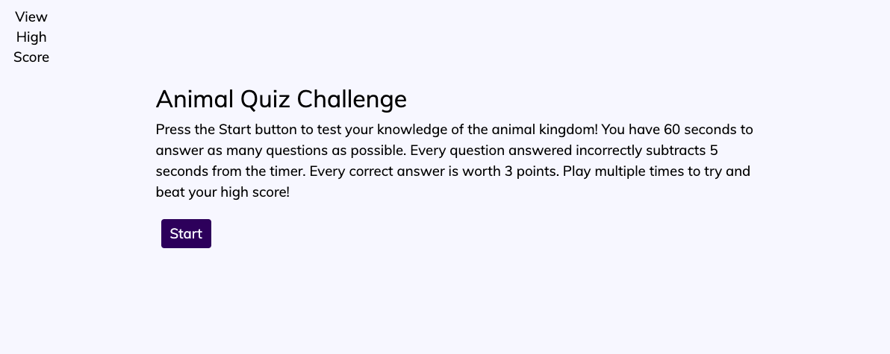
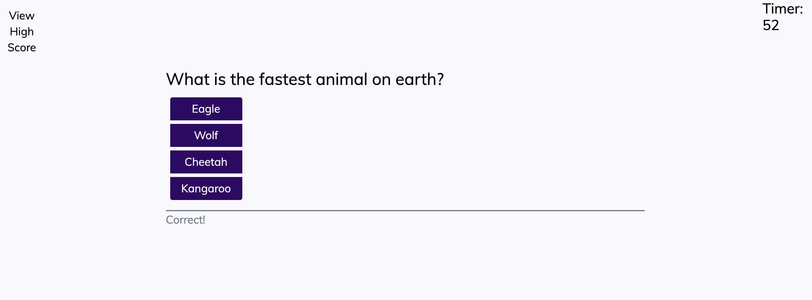

# Test your Knowledge of the Natural World

The Animal Quiz asks the user a series of animal trivia questions.  As soon as the user clicks "Start Quiz" the timer begins.  Every questions answered correctly gains 3 points, and every question answered incorrectly deducts 10 seconds from the timer!

## About

The Animal Quiz is a great way to brush up on your natural history knowledge.  At the end of every quiz the user has the opportunity to save their high score and play again.  Send the quiz to a friend and see who can get the most points in 60 seconds.  Are you really king of the jungle?

Good luck!

## Appearance

URL to quiz: https://kmvanneste.github.io/Code-Quiz/

Image of the starting page:

Image of a quiz question:

